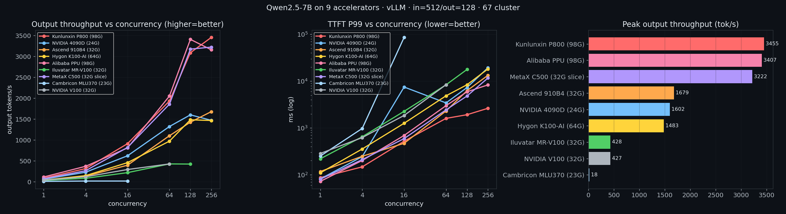
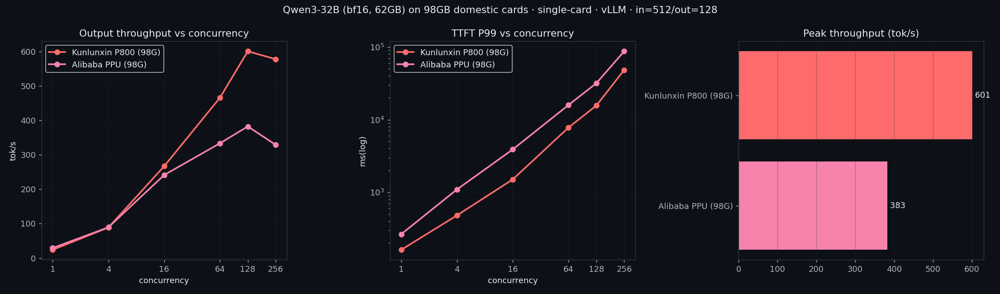

> **TL;DR** — Same Qwen2.5-7B, same load (`in=512 / out=128`), one card each, swept to saturation. Peak output throughput, high to low: **Kunlunxin P800 3455 · Alibaba PPU 3407 · MetaX C500 3222 · Ascend 910B4 1679 · RTX 4090D 1602 · Hygon K100-AI 1483 · Iluvatar MR-V100 428 · V100 427 · Cambricon MLU370 18** (tok/s). Two 98 GB domestic cards beat a consumer 4090D by **2×** at high concurrency — big VRAM holds a big KV cache, which is the whole game for throughput-bound serving. But the sharper finding: **MetaX cracked the podium with only a 32 GB slice** (at full compute), which means for a 7B dense model the bottleneck is compute/bandwidth, *not* capacity.

This is the follow-up to [the NVIDIA baseline post](../qwen25-7b-4090d-vs-v100/) — same methodology, now across seven domestic accelerators plus the two NVIDIA cards for reference.

## Why this benchmark exists

Public LLM-inference benchmarks almost always run one card in isolation, on whatever the author owns. Cross-vendor numbers on the *same model, same load, same measurement tool* barely exist — and for Chinese domestic accelerators (Kunlunxin, Ascend, Hygon, MetaX, Cambricon, Iluvatar, Alibaba PPU) they're close to nonexistent, because you need physical access to a cluster that has all of them racked. I have that. So I ran nine cards side by side and I publish every number with its exact command. You can't fake a real-machine number, and that's the point.

## The one-glance result



Peak output throughput, unified Qwen2.5-7B, swept to saturation:

| Rank | Card | VRAM | Peak tok/s | vs 4090D |
|---|---|---|---:|---:|
| 🥇 | **Kunlunxin P800** | 98 GB | 3455 | 2.16× |
| 🥈 | **Alibaba PPU ZW810E** | 98 GB | 3407 | 2.13× |
| 🥉 | **MetaX C500** | 32 GB slice · full compute | 3222 | 2.01× |
| 4 | Ascend 910B4 | 32 GB | 1679 | 1.05× |
| 5 | NVIDIA 4090D | 24 GB | 1602 | 1.00× (baseline) |
| 6 | Hygon K100-AI | 64 GB | 1483 | 0.93× |
| 7 | Iluvatar MR-V100 | 32 GB | 428 | 0.27× |
| 8 | NVIDIA V100 | 32 GB | 427 | 0.27× |
| 9 | Cambricon MLU370-X4 | 23 GB | 18 | 0.01× |

## What's under test

| Dimension | Value |
|---|---|
| Model | `Qwen2.5-7B-Instruct`, dtype **float16**, byte-identical checkpoint on every card (sha256 on config / index / tokenizer + safetensors sizes all matched) |
| Load | `random` dataset, fixed **input=512 / output=128** tokens, `--ignore-eos`, `--seed 42` |
| Sweep | max-concurrency ∈ {1, 4, 16, 64, 128, 256}, stop when throughput stops climbing (<3%) |
| Tool | vLLM's own `vllm bench serve` on every card |
| Clusters | 67 (all domestic + NVIDIA), 183 (Ascend 910B4) |

The load is deliberately the same as the NVIDIA post so the numbers stack. Big cards weren't saturated at concurrency 64, so this run sweeps out to 256 — you can't rank "who's cheapest per token" until every card hits its own ceiling.

## Methodology

- One warmup run (concurrency 4, 20 prompts) discarded before each sweep.
- `--ignore-eos` forces exactly 128 output tokens per request → clean, comparable TPOT.
- num-prompts scaled with concurrency (50 / 100 / 200 / 400 / 512 / 768).
- TTFT = first-token time − send time; TPOT = per-output-token time excluding the first; throughput = output tokens / wall-clock.
- **Model identity was verified, not assumed.** Every card served the same Qwen2.5-7B release — checked by hashing `config.json` / `model.safetensors.index.json` / `tokenizer.json` and comparing safetensors shard sizes. "Same model name" is not the same as "same bytes"; I checked the bytes.

> **The honest caveat, up front:** the model is unified, but the **engine version is not** — each vendor ships its own vLLM fork (versions in the table below). The V100 literally cannot run a modern engine (see the baseline post's software-cliff finding), and domestic cards only run their own vendor build. So this is *"each card at its practical best,"* not *"same engine, different silicon."* I call that out rather than bury it. Real cross-vendor benchmarking is honest benchmarking, or it's marketing.

## Full per-card sweeps

Output throughput (tok/s) by concurrency:

| conc | Kunlun P800 | Alibaba PPU | MetaX C500 | Ascend 910B4 | 4090D | Hygon K100 | Iluvatar V100 | NV V100 | Cambricon |
|---:|---:|---:|---:|---:|---:|---:|---:|---:|---:|
| 1   | 86    | 115   | 73    | 36    | 61    | 40    | 33    | 39    | 10 |
| 4   | 316   | 371   | 265   | 134   | 229   | 147   | 84    | 119   | 18 |
| 16  | 912   | 810   | 822   | 397   | 622   | 459   | 219   | 294   | 18 |
| 64  | 1934  | 2052  | 1856  | 1102  | 1323  | 973   | 428   | 427   | — |
| 128 | 3088  | 3407  | 3174  | 1426  | 1602  | 1483  | 424   | —     | — |
| 256 | 3455  | 3157  | 3222  | 1679  | 1470  | 1467  | —     | —     | — |

Latency at the point that matters for interactivity — TTFT p99 / TPOT p50, concurrency 16 (a realistic mid load):

| Card | TTFT p99 (ms) | TPOT p50 (ms) |
|---|---:|---:|
| Alibaba PPU | 691 | 11.6 |
| Kunlunxin P800 | 520 | 14.5 |
| MetaX C500 | 592 | 16.3 |
| NVIDIA 4090D | 7472* | 19.0 |
| Hygon K100-AI | 1258 | 28.4 |
| Ascend 910B4 | 470 | 36.6 |
| NVIDIA V100 | 1848 | 42.8 |
| Iluvatar MR-V100 | 2263 | 54.0 |
| Cambricon MLU370 | 85888 | 217.4 |

<small>*4090D's TTFT-p99 spike at conc 16 is a tail artifact (a prefill chunk stalling a few requests); its p50 TTFT at conc 16 was 155 ms. Full JSON in the repo.</small>

## Peak throughput is a vanity metric — the SLO-safe number reshuffles everything

Raw peak tok/s quietly assumes you'll accept *any* latency to get it. Real serving has an SLO. So apply a typical interactive one — **TTFT p99 ≤ 2 s and TPOT p99 ≤ 50 ms** — and ask the question that actually decides a purchase: *what's the highest throughput each card sustains without breaking that SLO?* The ranking falls apart and reforms:

| Card | Peak tok/s | **SLO-safe tok/s** | % of peak kept | at concurrency |
|---|---:|---:|---:|---:|
| **Kunlunxin P800** | 3455 | **1934** | 56% | 64 |
| MetaX C500 | 3222 | 822 | 26% | 16 |
| Hygon K100-AI | 1483 | 458 | 31% | 16 |
| Ascend 910B4 | 1679 | 397 | 24% | 16 |
| **Alibaba PPU** | 3407 | **371** | 11% | 4 |
| NVIDIA 4090D | 1602 | 229 | 14% | 4 |
| Iluvatar MR-V100 | 428 | 33 | 8% | 1 |
| Cambricon MLU370 | 18 | never meets SLO | — | — |

The headline writes itself: **Kunlunxin and Alibaba PPU look tied on peak (3455 vs 3407), but under the SLO, Kunlun sustains 1934 tok/s and PPU only 371 — a 5× gap the leaderboard completely hides.** PPU sprints to its peak by letting TTFT and tail-TPOT balloon (at concurrency 64 its p99 TTFT is ~3 s, past the SLO); Kunlun holds latency *while* scaling. If you serve interactive traffic you are buying the SLO-safe number, not the peak — and it orders the cards differently. (The exact figures shift with your SLO thresholds; the *lesson* — peak ≠ SLO-safe, and they reorder the field — does not. This is why "goodput," not peak throughput, is the number serious inference platforms track.)

## What the numbers say

**1. Big VRAM is a throughput weapon — at high concurrency.** The two 98 GB cards (Kunlunxin P800, Alibaba PPU) peak at 3400+, double the 24 GB 4090D. Not because their silicon is 2× faster — at concurrency 1 they're only ~1.4–1.9× the 4090D. The gap opens up as concurrency climbs, because 98 GB holds a huge KV cache, which lets the scheduler keep hundreds of requests in one batch. Throughput-bound serving is a memory game before it's a FLOPs game.

**2. …but capacity isn't the whole story.** MetaX C500 took bronze on a **32 GB slice** (full compute, half the card's memory), beating the 4090D by 2×. A 7B model in fp16 is ~14 GB of weights; 32 GB leaves plenty for KV at moderate batch. So capacity only cashes out when you actually need a giant KV — very high concurrency, or a big model. For 7B dense, compute + bandwidth is the binding constraint, and MetaX has it.

**3. Ascend 910B4 ≈ 4090D.** 1679 vs 1602 — the 910B4 edges out a consumer 4090D. A solid, unglamorous inference card.

**4. "Benchmarked against the V100" is literally true for the Iluvatar.** MR-V100 peaks at 428 tok/s; a real NVIDIA V100 does 427. Named after its target, and it hits it exactly.

**5. A small card on a 7B dense model is a trap.** Cambricon MLU370-X4 (23 GB) tops out at 18 tok/s and its TTFT blows past 85 *seconds* at concurrency 16. That card is built for small models / embeddings, not 7B dense serving. Right tool, wrong job.

## The 32B test: only the big cards even start

The clearest argument for 98 GB isn't the 7B numbers — it's that a 62 GB bf16 **Qwen3-32B fits on one card at all**. The 4090D (24 GB), V100 (32 GB), and Ascend 910B4 (32 GB) can't hold it single-card; they need tensor-parallel across multiple GPUs. The two 98 GB cards just load it.



| Card | VRAM | Qwen3-32B peak tok/s | vs its own 7B |
|---|---|---:|---|
| Kunlunxin P800 | 98 GB | **601** | 3455 → 601 (5.7× slower) |
| Alibaba PPU | 98 GB | 383 | 3407 → 383 (8.9× slower) |

On 7B the two are neck-and-neck (3455 / 3407); on 32B the P800 pulls clearly ahead (601 vs 383). Bigger models lean harder on compute and memory bandwidth, and the P800 has more headroom there. Single-card 32B capability is itself the domestic big-card value proposition — no TP topology, no interconnect tax.

## Engine versions (an unlocked benchmark is garbage in three months)

| Card | vLLM build | Notes |
|---|---|---|
| Kunlunxin P800 | vllm-kunlun v0.11.0 (XPU) | SR-IOV; scheduler can land you on a busy VF → delete+recreate pod |
| Alibaba PPU | 0.20.1+ppu / torch 2.10 | — |
| MetaX C500 | vllm-metax 0.11.2 / maca 3.3 | `vllm` lives at `/opt/conda/bin/vllm`, not on PATH |
| Ascend 910B4 | vllm-ascend 0.18 (CANN) | on the 183 cluster |
| Hygon K100-AI | 0.11.0+dtk / torch 2.5 (HIP/ROCm) | — |
| Iluvatar MR-V100 | vllm-iluvatar 4.4.0 | — |
| Cambricon MLU370 | 0.6.4+mlu / torch 2.5 | light sweep only (too slow past conc 4) |
| NVIDIA 4090D | vLLM 0.20.0 | baseline |
| NVIDIA V100 | vLLM 0.8.5.post1 | Volta dropped from 0.20 — see baseline post |

## Reproduce it yourself

```bash
# Serve (inside each vendor's GPU pod; model from a local/NFS path avoids the download saga)
vllm serve /models/Qwen2.5-7B-Instruct --served-model-name qwen2.5-7b \
  --dtype float16 --gpu-memory-utilization 0.90 --max-model-len 4096 --port 8000

# Sweep one concurrency level (repeat for 1,4,16,64,128,256):
vllm bench serve --backend vllm --model qwen2.5-7b \
  --tokenizer /models/Qwen2.5-7B-Instruct --host 127.0.0.1 --port 8000 \
  --dataset-name random --random-input-len 512 --random-output-len 128 --ignore-eos \
  --percentile-metrics ttft,tpot,itl --metric-percentiles 90,99 --seed 42 \
  --max-concurrency 64 --num-prompts 400 --save-result --result-filename c64.json
```

Per-vendor quirks, pod YAMLs, and the full data are in the repo.

## What surprised me / gotchas (the part AI can't fake)

- **A "free" MetaX card that wouldn't schedule.** The index-0 C500 showed 0% utilization and no processes — genuinely idle — yet no pod would land on it. The root cause was a *driver-level* quota leak: `mx-smi` reported `total_vram_quota=3813` instead of the full `64549` MiB, because a previous GPU-virtualization (sGPU) tenant had died without returning its memory quota. The card *looked* idle, but the driver believed it was full, so nothing could be placed on it. **The transferable lesson: on domestic sGPU stacks, "idle" is not "available" — you have to read the driver's memory *quota*, not the utilization number.** Reclaiming a leaked quota is a platform/operator-level operation, not something a tenant should be doing on a shared cluster — so the practical move is to *detect* the discrepancy and steer your workload onto a healthy card. That whole class of "utilization lies, check the quota" bug is something the NVIDIA ecosystem rarely hands you.
- **Cross-subnet bandwidth, not the GPU, was the wall.** Getting 14 GB of weights onto remote nodes (172.28.4.x) from the model source (10.100.121.x) crawled at ~1–10 MB/s over NFS, SSH tunnel, and pod network alike. And three pods reading the same NFS checkpoint in parallel dragged it to a near halt. The fix was mundane and total: serve each card from a checkpoint already local to its node.
- **The scheduler layer is its own source of "why won't this run."** These clusters run an open-source heterogeneous-GPU scheduler in front of the vendor device plugins; until it's pointed at a resource pool your workload is allowed to use, pods just sit `Pending` — trivial once you know, an hour of confusion if you don't. On heterogeneous clusters, "the GPU is free" and "the scheduler will give it to you" are two separate questions.

## Caveats & what I'd test next

- Different engine versions across vendors (unavoidable — each card only runs its own fork). The model is unified and byte-verified; the engine is "each card's own best."
- Single card, single model, one input/output shape. No cross-vendor TP, no long context, no quantization — yet.
- **perf-per-¥** — the ranking that actually decides a platform purchase is tokens-per-¥, not tokens/s. I don't have trustworthy street prices for these domestic cards, so I'm not going to invent them. If you have real quotes, this is where they go.
- **[Part two](../domestic-accelerators-multicard-tp/) does exactly this**: tensor-parallel scaling from 1 to 8 cards, 32B multi-card (Ascend carries it to TP8; most domestic stacks crash), and per-vendor vLLM tuning. The MetaX at its full 64 GB is still pending — its cards were busy every window I had.

---

*Spotted a methodology hole, or have real pricing for any of these cards? I'd rather be corrected in public than wrong in private — open an issue or ping me.*
