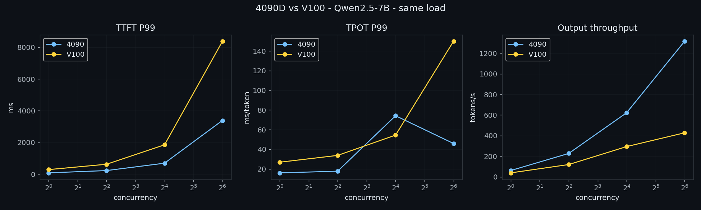

> **TL;DR** — 同一 Qwen2.5-7B、同一负载，每卡一张。并发 64 时 RTX 4090D 吐出 **1316 output tok/s，而 V100 只有 427——差 3.1 倍，且并发越高差距越大**（并发 1 时仅 1.6 倍）。但更锋利的发现在任何数字之上：**V100 根本跑不了现代 vLLM**——它的 Volta `sm_70` 架构被预编译的 PyTorch/vLLM 抛弃了，所以它被钉死在两年前的引擎上。完整数字和复现步骤在下面。

一张把结论怼到你脸上的表（Julia Evans 定律：大多数人只扫表格和标题）：

| 指标（单卡，并发 64） | RTX 4090D (24GB) | Tesla V100 (32GB) |
|---|---|---|
| output 吞吐 (tok/s) | **1316** | 427 |
| TTFT p50 / p99 (ms) | 864 / 3386 | 4152 / 8381 |
| TPOT p50 / p99 (ms) | 40 / 46 | 108 / 150 |
| 能跑的引擎 | vLLM v0.20.0 | vLLM **v0.8.5**（Volta 被 v0.20 抛弃） |

---

## 为什么有这篇跑分

几乎每一份公开的 LLM 推理跑分，都是单卡孤立跑、用作者恰好有的硬件。**同一模型、同一负载、同一测量**下，一张现代卡对一张老卡的 head-to-head 数字，比它本该有的还要稀缺——而跨厂商 / 跨代际的数据，才是真正决策发生的地方。我有一间塞满各式加速卡的实验室，所以我把它们并排跑，并附上确切命令发布。

这第一篇是 NVIDIA 基线：一张当代消费卡（RTX 4090D）对阵一张 2017 年的数据中心卡（V100，在中国集群里仍极其常见）。它奠定了后面每一篇（国产加速卡）复用的方法学。

## 测试口径

| 维度 | 值 |
|---|---|
| 模型 | `Qwen2.5-7B-Instruct`，dtype **float16**（两卡都是；V100 的 Volta 没有 bf16 硬件，所以 fp16 是公平且贴近生产的选择） |
| 硬件 A | 1× **RTX 4090D**，24GB，Ada `sm_89`，驱动 595.71.05 / CUDA 13.2 |
| 硬件 B | 1× **Tesla V100-PCIE**，32GB，Volta `sm_70`，同一集群 |
| 引擎 A | vLLM **v0.20.0**（torch 2.11.0+cu130） |
| 引擎 B | vLLM **v0.8.5.post1**（torch 2.6.0+cu124）——*被迫*，见踩坑 |
| 负载 | `random` 数据集，固定 **input=512 / output=128** token，`--ignore-eos` |
| 扫并发 | max-concurrency ∈ {1, 4, 16, 64}，`--request-rate inf`（闭环） |

## 方法学

- 每次扫描前跑一轮 warmup（并发 4、20 条 prompt）并丢弃。
- `--ignore-eos` 强制每条请求恰好吐 128 个 output token → TPOT 干净可比。
- 固定 `--seed 42`；num-prompts 随并发放大（50 / 100 / 200 / 400）。
- TTFT = 首 token 时刻 − 发送时刻；TPOT = 除首 token 外每 token 时间；吞吐 = output token / 墙钟时间。
- 用 vLLM 自带的 `vllm bench serve` 测。两卡跑完全相同的模型权重（同一个 NFS 挂载的 checkpoint）和完全相同的请求形状。

> 没有方法学就没有跑分。唯一要紧的 caveat：**两卡跑的引擎版本不同**（V100 压根跑不了新的——见下），所以这是"每卡各自的实际最佳"，不是"同一引擎、不同硅片"。我把这一点点破，而不是藏起来。

## 结果

### 逐一对拼



完整逐卡 sweep：

| 并发 | 4090D tok/s | 4090D TTFT p50/p99 | 4090D TPOT p50/p99 | V100 tok/s | V100 TTFT p50/p99 | V100 TPOT p50/p99 |
|---:|---:|---:|---:|---:|---:|---:|
| 1  | 61.4  | 72.6 / 78.5    | 15.9 / 16.0 | 38.5  | 163.7 / 284.6  | 23.8 / 26.8  |
| 4  | 227.0 | 100.2 / 223.9  | 16.7 / 17.7 | 119.2 | 553.9 / 621.7  | 30.1 / 33.7  |
| 16 | 622.4 | 147.1 / 687.8  | 18.5 / 74.1 | 293.8 | 1172 / 1848    | 42.8 / 54.4  |
| 64 | 1316.3| 864.2 / 3385.9 | 39.9 / 45.9 | 427.4 | 4152 / 8381    | 107.6 / 150.0|

逐卡细节：[4090D](curve-4090.png) · [V100](curve-v100.png)

**我看到的：** 吞吐差距*随负载放大*。并发 1 时 4090D 只是 V100 的 1.6 倍（61 vs 38 tok/s）——如果你一次只服务一条流，老卡够用。但到并发 64，差距是 3.1 倍（1316 vs 427）。新架构（Ada + FlashAttention-2 + 更新的调度器）只在 batch *填满*时才兑现它的优势。买新硅片是为吞吐型服务，不是为单条低 QPS 流。

### 每元性能视角

大多数跑分比的是"快 vs 慢"。对一个平台真正要紧的问题是"每 token 便宜 vs 贵"。

- 粗略街价（**待核实**）：RTX 4090D ≈ ¥14k 全新；Tesla V100 32GB ≈ ¥6–8k 二手（EOL）。
- 并发 64 时：4090D ≈ 1316 tok/s / ¥14k ≈ 每元 0.094 tok/s；V100 ≈ 427 / ¥7k ≈ 每元 0.061 tok/s。
- 所以 4090D 大约**每元 token 好 1.5 倍**，而且你不用落后引擎两年。V100 只在你已经拥有它、机架是沉没成本时才划算。

## 让我意外的地方 / 踩坑（AI 编不出来的部分）

- **V100 掉的是软件悬崖，不是性能悬崖。** 在当前 vLLM 镜像上启 Qwen2.5-7B 瞬间就挂——不是慢，是*死*：`CUDA error: no kernel image is available for execution on the device`，卡在一个普通的 `torch.zeros` 上。镜像的 `torch 2.11.0+cu130` 编译目标是 `['sm_75, sm_80, sm_86, sm_90, sm_100, sm_120']`——**`sm_70`（Volta）没了**。只有降回 vLLM **v0.8.5**（torch 2.6，仍带 `sm_70`）V100 才跑起来。老卡真正的代价不是它慢——是现代软件栈停止为它出 kernel，你悄无声息地丢掉了两年的引擎优化。这在任何单卡 tok/s 数字里都看不见。
- **一个 TPOT-p99 交叉。** 4090D 的*尾部* TPOT 竟然从并发 16 的 74ms *降到*并发 64 的 46ms，而 V100 单调爬到 150ms。我的解读：在 16 时新调度器偶尔让一个 decode 卡在一个 prefill chunk 后面挨饿；到 64 时 batch 足够密就抹平了。值得单独做一个调度参数实验。
- **把权重弄上节点比跑分还难。** `docker.io` 被墙、HuggingFace 被墙，`hf-mirror` 不代理 HF 新的 Xet 存储后端（所以权重下载会静默超时在 `cas-bridge.xethub.hf.co`）。ModelScope 能用但只有 ~1.6 MB/s。真正管用的解法：挂集群已有的 model PVC（RWX/NFS）只读，从本地路径起服务——零下载。

## 自己复现

```bash
# 起服务（在 GPU pod 内；模型走本地/NFS 路径，绕开下载噩梦）
vllm serve /models/Qwen2.5-7B-Instruct --served-model-name qwen2.5-7b \
  --dtype float16 --gpu-memory-utilization 0.90 --max-model-len 4096 --port 8000

# 扫一个并发档（对 1,4,16,64 逐个重复），4090D / vLLM v0.20：
vllm bench serve --backend vllm --model qwen2.5-7b \
  --tokenizer /models/Qwen2.5-7B-Instruct --host 127.0.0.1 --port 8000 \
  --dataset-name random --random-input-len 512 --random-output-len 128 --ignore-eos \
  --percentile-metrics ttft,tpot,itl --metric-percentiles 90,99 --seed 42 \
  --max-concurrency 64 --num-prompts 400 --save-result --result-filename c64.json

# 在 V100 / vLLM v0.8.5 上 bench CLI 不同：
#   把  --backend vllm   换成   --endpoint-type openai-comp --endpoint /v1/completions
```

版本锁定（不锁版本的跑分三个月就是垃圾）：

| 组件 | 4090D | V100 |
|---|---|---|
| 引擎 | vLLM 0.20.0 | vLLM 0.8.5.post1 |
| torch / CUDA | 2.11.0+cu130 / 驱动 595.71.05 (CUDA 13.2) | 2.6.0+cu124 |
| 模型 | Qwen2.5-7B-Instruct (fp16) | 同一 checkpoint |

## 局限 & 接下来测什么

- 两卡引擎版本不同（V100 没给我选择）。更干净的对比是两卡钉同一个老引擎——但那样 4090D 就秀不出它真实的最佳。我选了"每卡按你真实部署的样子"。
- 单卡、单模型、单一 input/output 形状。没有 TP、没有长上下文、没有量化。
- 接下来：同样的对拼铺到**国产加速卡**上（昇腾 / 寒武纪 / 海光 / 沐曦）——几乎没人公开的数字，也是这个博客存在的全部理由。

---

*发现方法学漏洞？我宁愿在公开场合被纠正，也不愿在私下里错着——开个 issue 或 ping 我。*
